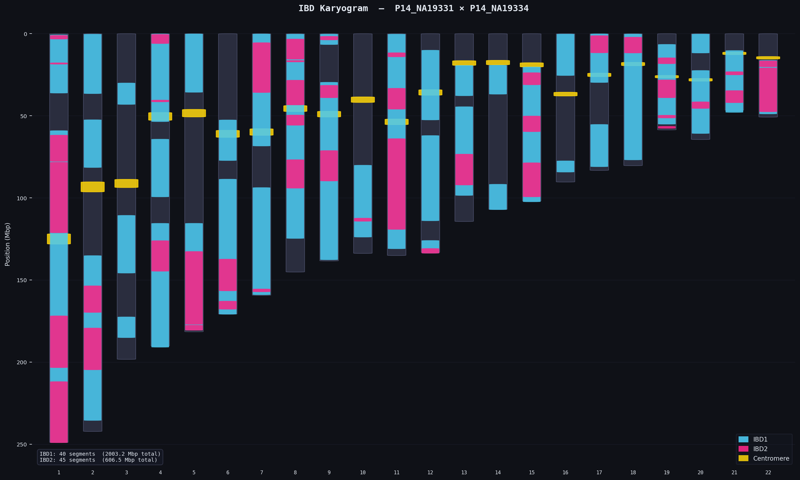

## About
This is the repo for the Personal Genomics (CSE 284) project of Michael Iter, Dan Musachio, and Jonah Silverman.

We implemented a method to detect Identical By Descent (IBD) segments using unphased genotypes between two individuals.

We are calling our tool IBDbIBSbIDS, as we are using runs of Identical by State (IBS) alleles to infer when the chromosomal segment being considered shares the same ancestral origin (IBD), and we are IDS (Iter, Dan, Silverman).

Our algorithm is inspired by and will benchmark against the tool TRUFFLE[^1].

[^1]: Dimitromanolakis A, Paterson AD, Sun L. Fast and Accurate Shared Segment Detection and Relatedness Estimation in Un-phased Genetic Data via TRUFFLE. Am J Hum Genet. 2019 Jul 3;105(1):78-88. doi: 10.1016/j.ajhg.2019.05.007. Epub 2019 Jun 6. PMID: 31178127; PMCID: PMC6612710.

# Data

To run the same data that we ran, go to 'data_access_link.txt'. There will be a link to google drive. The text file should describe the path to the two main files we use. Each of the files are VCFS (and tbis) of fully related individuals. 

# Usage

## Installation
Our tools runs in native python. All necessary packages can be installed using conda and the provided requirements.yaml
```
git clone https://github.com/Jonahs11/IBD_B_IBS_B_IDS.git

conda env create -f requirements.yaml
conda activate IBD_env
```
## Running
Data paths and parameter choices are organized using a config.json file. An example of one of these files can be found in the config_files directory. Many choices have defaults set, but the vcf path of interest and samp1/2 ids **must** be set in this file prior to running.

Once these fields are set, pass in the config file path using the --config flag.

```
python run_IBD_calc.py --config <Path to config>
```

# TRUFFLE Usage
Here is the command to run truffle:
```
./truffle --vcf $file --segments #OPTIONALLY: --mindist 2000 --maf 0.1 --cpu 4
```

### Outputs
- `truffle.ibd` holds the IBD 0,1,2 predicted percentages per pair in your VCF
- `truffle.segments` holds the predicted IBD segments in every chromosome you have data for

### Processing
- `./get_pair_segments.sh {person1} {person2} {segments file}` extracts just the pair you are interested in
  - outputs a pair segment file `{p1}_{p2}.segments`
- `python karyogram_ibd.py {pair segment file} --out karyogram.png` exports a karyogram visualizing IBD segments for all chromosomes of the pair you are interested in
  - Note: Claude Sonnet 4.6 assisted in generating this visualization code
  - Here is an example output for a sibling pair in 1000 Genomes: 

# Novel Algorithm Development
We also tried developing a novel algorithm that uses different math than TRUFFLE. For each SNP, using MAF, we calculate the odds that the SNP is located in IBD0, 1, or 2. We then convert to log odds. We smoothed the odds for IBD2 to limit odds of 0. From there we made 1k long SNP blocks and calculated which IBD state is most likely. Then we smoothed blocks by exploring in windows of 10 blocks. The customizable script is available to run as a ipynb and is avaiable in the repo as Unique_IBD_Algo.ipynb

### Outputs
  - Note: GPT 5 assisted in generating the visualization code
  - Here is an example output for a sibling pair in 1000 Genomes for chr21 and chr22: ![Karyogram of IBD segments for sibling pair in 1000 Genomes for chr 21 and chr22] (figures/unique_karyogram.png)

 
# Still TODO
1. Clean up repo organization
2. Improve custom IBD segment prediction
3. Evaluate custom method vs. TRUFFLE with appropriate runtime and concordance statistics/visualizations
